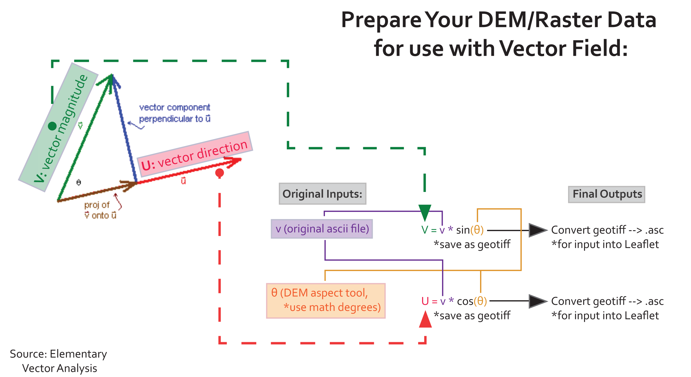

## Solar-induced chlorophyll fluorescence

#### Seasonal greenup patterns: a hemispheric view

**Prepared for GEOG 572: Geovisualization at Oregon State University**

### 1. Data

Solar-induced chlorophyll fluorescence (SIF) is a relatively new remote sensing index. In contrast to traditional vegetation indices (NDVI, EVI), SIF is connected to the physiology of plant production, rather than the greenness of vegetation. SIF is also more sensitive to intra-annual variation in production related to heat and drought stress. SIF is correlated with the light use efficiency of photosynthesis (LUE; Guanter et al.2014) and with absorbed photosynthetically activeradiation (APAR; Rossini et al. 2010). Thus, SIF provides an ideal proxy for gross primary production (GPP) of an ecosystem.

SIF is measured by the NASA GOME-2 satellite at 0.5 decimal degree spatial resolution. SIF data products cover the globe, and are provided at daily and monthly temporal resolution, from 2002-present. SIF data are uploaded shortly after they are observed, and are available from [NASA](https://avdc.gsfc.nasa.gov/pub/data/satellite/MetOp/GOME_F/). All of our data will be sourced from this site. For this project, we will use monthly data to minimize processing. A focus of our data visualization will be quantifying and visualizing the impacts of a 2012 drought on North America.

For more info about SIF, check out this article from [NASA's Jet Propulsion Lab](https://www.jpl.nasa.gov/news/news.php?release=2014-097).

### 2. Visualization

This visualization is designed to highlight seasonal patterns of greenup in the Northern Hemisphere, vs. the Southern Hemisphere. This is accomplished by displaying map tiles that represent the seasonal difference in SIF, which is a proxy for photosynthesis, calculated as (July - January), for the Northern Hemisphere, and (January - July), for the Southern Hemisphere. January and July values are averaged for the month of interest from 2010-2013. 

The tiles are accompanied by vector field animation, which is a dynamic way to represent the locations in which there is a more pronounced seasonal difference than others. The vector field animation emphasizes areas with strong greenup patterns, and also demonstrates that there is spatial variation within the greenup patterns in those areas. The vector field animation was developed by [IH Cantabria](https://github.com/IHCantabria/Leaflet.CanvasLayer.Field).

The bar charts display frequency tables of the pixel values that represent the magnitude of the seasonal greenup. The bar charts were generated using Crossfilter. The bar charts take the data in the seasonal greenup tiles, but the data are converted to geojson files where each point represents one of the cells in the raster tiles.


### 3. Data Prep

Data prep was executed in [R](https://github.com/lleather/sif_vector/blob/master/R/prep_vectorfield_raster_function.R). The data prep involved: 

- averaging and stacking january and july rasters for 2010-2013, calculating mean rasters for january and july, and calculating the magnitude of seasonal greenup. 
- calculating *u* and *v* rasters for the vector field calculation. I executed this by writing a function to convert the raster representing the magnitude of the season greenup to vector magnitude and direction. [Brian Katz's vector field tutorial](https://github.com/briangkatz/vector-field-animation) and personal help was invaluable in this process.


### 4. Vector field animation tutorial  

This project uses the Vector Field Animation and Scalar Field derivation developed by [IH Cantabria](https://github.com/IHCantabria/Leaflet.CanvasLayer.Field). This package was interpreted by [Brian Katz](https://github.com/briangkatz/vector-field-animation), who developed an excellent tutorial for implementing this utility.


#### 4.1 Vector field animation: what is it?

Vector field animation is a method of visualizing the *magnitude* and *direction* of cells in a raster. When an input raster does not explicitly represent a magnitude or direction raster, the vector field can be used to visualize *heterogeneity* in the input raster, and the relative patterning of that heterogeneity. I.e., where are there differences in the value of the rasters? And in contrast to visualizing these differences statically: in which direction are the differences oriented?


#### 4.2 Vector field background

To use the Vector Field utility, you must create input rasters that represent both the *magnitude* and the *direction* of the vector that you wish you visualize. You cannot simply input your raw raster. Importantly, the Vector Field utility uses inputs in ASCII (.asc) format.

Brian provides a great explanation of vectors:

> [The vector components of your original data] are called **U** and **V**.
>
> - **V** relates to the vector **magnitude**
> - **U** relates to the vector **direction**
>
> [](https://github.com/briangkatz/vector-field-animation/blob/master/img/vector_components.png)
>
> Source: [Elementary Vector Analysis](https://www.math.hmc.edu/calculus/tutorials/vectoranalysis/vectoranalysis.pdf)
>
> In the figure above, the perpendicular lines represent the **V** (blue) and **U** (red) vector components that the Leaflet.CanvasLayer.Field library uses to dynamically calculate and animate the original data's magnitude (pixel values). Thus, the *green* line labeled **v** represents your starting ASCII raster that you want visualized from two other ASCII rasters, **V** and **U**.


While GUI-based GIS softwares can execute this task, script-based analysis streamlines this process. The [R](https://www.r-project.org/) coding environment includes a [raster](https://cran.r-project.org/web/packages/raster/index.html) package that is ideal for processing and analyzing raster data.

The workflow is as follows:



Workflow designed by [Bran Black](https://github.com/BranBlack3125).

#### 4.3 Preparing vector inputs using R

In your R coding environment ([R Studio](https://www.rstudio.com/) is strongly recommended), open a new script. 

**4.3.1 First, load the necessary libraries.** If you do not already have the requisite libraries installed, you can install them using the install.packages() command (commented out below): 

The package geojsonio has a lot of dependencies, and make take some trouble-shooting and installing supporting packages in order to get it to load. 

```r 
#install.packages(c("raster", "geojsonio"))
#libraries
library(raster)
library(geojsonio)
```

**4.3.2** Then **create objects that name the directories where you will be working.** I prefer to do this, rather than setting the working directory (e.g, setwd()), so that I have more control over where objects are exported, and because naming the directories explicitly works better in an [R Markdown](https://rmarkdown.rstudio.com/) framework. I use separate directories for my working directory, and the directory for this project 

E.g., 

```r 
js_dir <- "/Volumes/classes/GEOG572/Students/leatherl/sif_vector/assets/vector_field/"
```

**4.3.4** The **function used to calculate ** the **u** and **v** rasters is below. This function takes as an input: 

* a raw magnitude raster that you wish to visualize (r)
* a string indicating the type of vector that should be returned (type, can be "v" or "u")

This function calculates both u and v rasters from the input. 

```r 
##
###### CALC VECTOR FIELDS: WRITE FUNCTION FORM
##

vector_UV <- function(r, type) {
  
  require(raster)
  
  #load input magnitude vector of interest-- whatever you want to visualize
  #this should be a .asc file
  mag <- r
  
  #type tells the function which type of vector raster to return
  #"type" should be either "u" or "v"
  out <- type
  
  #convert to "terrain" / theta raster
  #computes the relative "angle", or direction of movement, of the magnitude raster, in decimal degrees
  mag_t <- terrain(mag, opt = "aspect", unit = "degrees")
  
  #adjust angle of movement for theta raster - default is off by 90 degrees
  mag_abs <- raster::calc(mag_t , fun=function(x){x -270})
  
  # calc direction of movement
  # calculated as initial raster * cos(direction)
  
  # V raster: vector magnitude. 
  # calculated as sin(theta) * input 
  mag_v <- overlay(mag_abs, mag, fun=function(x, y){sin(x) * y})
  
  # U raster: vector direction. 
  # calculated as cos(theta) * input 
  mag_u <- overlay(mag_abs , mag, fun=function(x, y){cos(x) *y})
  
  ifelse(out == "v", return(mag_v), 
         ifelse(out == "u", return(mag_u), 
                NA))
  
}
```

You can copy this function directly into your R script. You will call it to calculate your vector rasters of interest. 

**4.3.5 Load your data.**

The raster() command loads in raster format files. Your raw magnitude input raster can be in any raster format; we will convert it to .asc later. 

Load in your input raster:

```r 
## input raster load from file: 
july_jan_mag <- raster(paste0(js_dir, "input_asc/july_jan_mag_simple.asc"))
```

Though the Vector Field utility calculates a derived raw magnitude layer to visualize, this looks distinct from the raw input raster (for a reason that I haven't yet figured out). Thus, I am still plotting the original input raster under my vector field animation-- which also needs to be in .asc format. If you would like to do the same, you can export your input file as a .asc file using the writeRaster() function. 

```r 
# convert to .asc for visualization, if necessary
writeRaster(july_jan_mag, paste0(js_dir, "input_asc/july_jan_mag_simple.asc"), overwrite = TRUE)

```

**4.3.6 Set the projection.** The vector field calculation function in R needs the input rasters to have a projection specified. The Vector Field utility in js requires EPSG 4326. 

``` r
#set projection
#scalar field needs EPSG 4326
proj <- "+init=EPSG:4326 +proj=longlat +datum=WGS84 +ellps=WGS84 +towgs84=0,0,0"
crs(july_jan_mag) <- proj
```
**4.3.7 Calculate your vectors.** Now that you have your raster loaded and in the correct projection, the next thing to do is to use the function to calculate your vectors. Because we wrote it above, all we have to do is call the function on our raw magnitude vectors of interest, being sure to *specify the type of vector we want* and *assigning the results to a new object.*

```r 
##
##### CALC VECTORS OF INTEREST
##

july_jan_mag_u <- vector_UV(july_jan_mag, "u")
july_jan_mag_v <- vector_UV(july_jan_mag, "v")

jan_july_mag_u <- vector_UV(jan_july_mag, "u")
jan_july_mag_v <- vector_UV(jan_july_mag, "v")
```

**4.3.8 Export your files as .asc**

The command writeRaster() in the raster package exports raster files in the format specified. Luckily, here we can export directly to .asc format. Be sure to export both the u and v files!

```r
####
#######EXPORT
####

#export to javascript directory
writeRaster(july_jan_mag_u, paste0(js_dir, "output_asc/july_jan_mag_u.asc"), overwrite = TRUE)
writeRaster(july_jan_mag_v, paste0(js_dir, "output_asc/july_jan_mag_v.asc"), overwrite = TRUE)
```

**4.3.9 Export your files as .geojson**

Most .js utilities for visualizing data in a coordinated view framework depend on data in a .geojson or a vector format-- not a raster format. However, we can convert our raster data into .geojson in R. This means that our data are stored as lists of points with values, rather than a grid. To do this, we first have to convert our raster data to points, and then use a function to write the output as a .geojson files. This function comes from the geojsonio package.

```r
# convert raster to points so that it can be converted to geojson
july_jan_mag_pts <- rasterToPoints(july_jan_mag)
# export as geojson
geojson_write(july_jan_mag_pts, file = paste0(js_dir, "json/july_jan_mag_simple.geojson"))
```

Now your data are ready to be visualized in the Vector Field framework!

#### 5 Building the vector field visualization: 

**5.1 Tutorial** My scripts are a little more complex because I load in multiple vector sets to compare. [Brian's vector field tutorial](https://github.com/briangkatz/vector-field-animation#3-a-function-by-function-tutorial) gives a more streamlined view of the process for visualizing a single vector field input. 

**Note:** To visualize the vector animation, the Vector Field package only needs the **u** and **v** input rasters. It also provides the .getScalarField() function to back-calculate the raw magnitude raster from the input u and v rasters. However, I found that the magnitude raster derived from this function differed from the raw magnitude input that I used to calculate the vector field rasters. Until I figure out why this is, to resolve the problem, I have simply visualized the raw magnitude input raster tiled under the vector field animation. 

**5.2 Visualizing multiple input types in the vector field / scalar field framework** of the **cool things** about this package is that you can read in as many additional inputs as you like, as long as you close the brackets at the end. For example:

```js
// ScalarField derived from a Vectorfield (from IHCantabria Leaflet.CanvasLayer.Field)
d3.text('assets/vector_field/output_asc/july_jan_mag_u.asc', function (u_n) { // add the U data in ASCIIGrid (.asc) format
    d3.text('assets/vector_field/output_asc/july_jan_mag_v.asc', function (v_n) { // add the V data in ASCIIGrid (.asc) format (if you want to see a flowing example, replace the V data with the v data (arag_2050_07_v_original.asc)
        d3.text('assets/vector_field/input_asc/july_mean.asc', function (jul_mean) { // add in another magnitude / scalar field raster to visualize - for each subsequent input, you have to add / nest an additional d3.text() command. be sure to end with another )}; at the end!
            
           var toMetersPerSecond = 1; // coefficient multiplied with the U and V data to determine the speed (magnitude) of the animated vector field; 
            
                    ////// for northern hemisphere visualization:    aka: july - january greenup

                    var vf_n = L.VectorField.fromASCIIGrids(u_n, v_n, toMetersPerSecond);  // create the vector field

                    // a) First derived field: Magnitude (m/s, or difference in SIF from jan to july)
                    var s_n = vf_n.getScalarField('magnitude');  // << derived ScalarField

                    var magnitude_n = L.canvasLayer.scalarField(s_n, {
                        color : chroma.scale(
                        ['#EDF0AD', '#E4F132', '#98CA32', '#559E54', '#10570F'], [-1, -0.5, 0, 0.5, 1.3]  // set color scale and break points for styling of magnitude layer
                        ),
                        opacity: 0.75, // 1 will block view of animation if magnitude layer is selected and brought to the front of the map object
                    interpolate: true, // uses bilinear interpolation to create a smoother-appearing surface
                    }).addTo(map);  // addTo(map) displays the layer on page-load vs. removing it keeps the layer off the map until the check-box is selected in the Leaflet layer control (see direction layer below for example)*/

            // d) additional magnitude / raster field
                    var jul_n = L.ScalarField.fromASCIIGrid(jul_mean);
                    var july_mean = L.canvasLayer.scalarField(jul_n, {
                            color: chroma.scale(
                                ['#EDF0AD', '#E4F132', '#98CA32', '#559E54', '#10570F'], [-1, -0.5, 0, 0.5, 1.3]  // set color scale and break points for styling of magnitude layer
                            ),
                         opacity: 0.75, // 1 will block view of animation if magnitude layer is selected and brought to the front of the map object
                        interpolate: true, // uses bilinear interpolation to create a smoother-appearing surface
                        });
            });
        });
    }); // ends data input blocks

```

**5.3 Grouping layers in the Leaflet layer control**

When you have added in all these fun different layers, you might want to be able to turn them on and off in [groups](https://leafletjs.com/examples/layers-control/)-- rather than one at a time, especially if you're comparing disparate phenomena, or want to turn the magnitude and vector layers on and off at the same time. 

The command L.layerGroup([]) makes this possible:

```js 
// e) Layer control

        // Define layer groups - group layers so that they are toggled on and off together

        var seasonal_nhemis = L.layerGroup([animation_n, magnitude_n]);
        var seasonal_shemis = L.layerGroup([animation_s, magnitude_s]); // stand in for southern hemisphere greenup
```

In the script above, each of the "animation_n" or "magnitude_n" layers are single Leaflet canvas layers.

We then use these groups in the L.control.layers() function. We can name the layers in the Layer Control to clarify what they refer to. We can also combine Layer Groups with non-grouped layers. 

The previous, non-grouped iteration of the Layer Control is commented out below.

```js 
L.control.layers({}, {
        //    "Vector animation": animation,
        //    "Derived magnitude": magnitude,
        //    "Derived direction": direction,
        //    "July Mean": julymean,
            "Seasonal Greenup: Northern Hemisphere": seasonal_nhemis,
            "Seasonal Greenup: Southern Hemisphere": seasonal_shemis,
            "July Mean": july_mean,
            "January Mean" : jan_mean
        }, {
            position: 'bottomleft',  // change to your preference
            collapsed: false  // false always displays check-boxes for the animation, magnitude, and direction layers; true creates a layer-selector icon which hides these check-boxes until hovered over or clicked on
        }).addTo(map);

```


